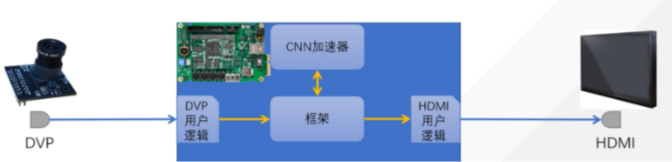

# [FPGA+DeepLearning]工业缺陷检测模型在FPGA端的加速优化项目

本项目旨在梳理和总结本人在**FPGA端优化算子的设计和模型优化**方向的学习和工作

## 更新列表-2023.03.30

- [ ] 具体工作梳理
- [ ] Demo复现
- [ ] Our work

## 一、方向脉络梳理

本次项目选用的框架是**Paddle+FPGA**，使用的编码为**C++、python、systemverilog**，后续再补充具体的任务细节

主要任务有：

- 网络端：选用轻量级的目标检测网络，针对具体应用场景进行改进，兼顾精度和推理速度
- FPGA端：
  - 运算算子模块的重新设计：CNN加速器、乘法器、加法器、矩阵运算
  - DVP时序处理算子设计
  - HDMI视频输出流设计
- ARM端：图像处理流程设计

## 二、复现Demo

### 网络端

本次实现的任务是工业缺陷检测，检测的类型总共四种，因此暂定选取的网络是SSD头的mobilenetv1

后续需要编写相对应的底层算子、以及对网络进行减枝、轻量化

## 三、Our Work

ing..............

## 四、知识点总结

ing..............

## Reference

**Thanks to：**

